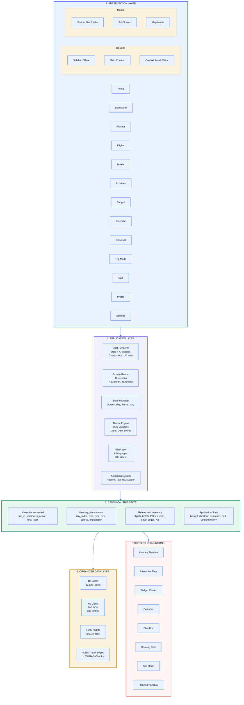
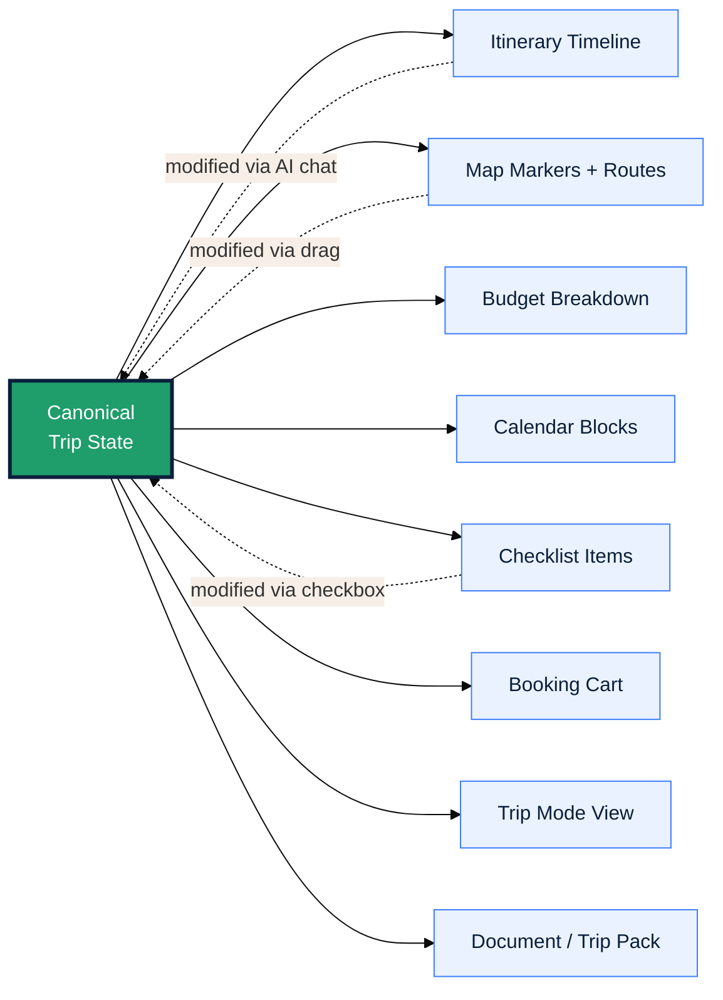
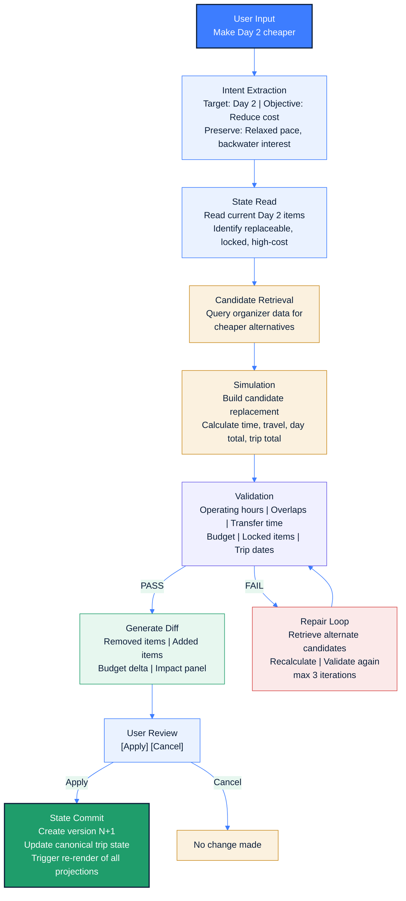
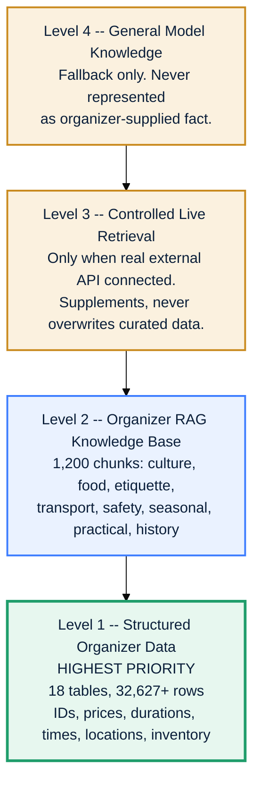
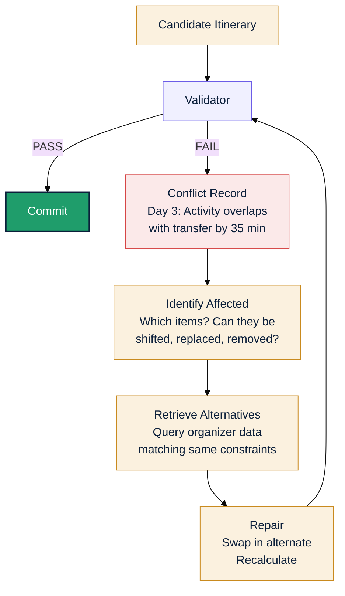
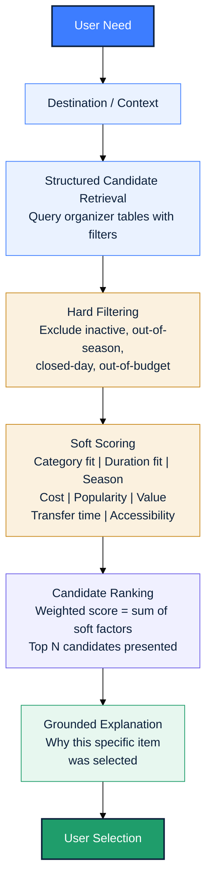

<div align="center">

# SmartTrip AI

### *Your trip, planned by conversation.*

**A stateful conversational travel-planning platform that turns plain-language intent into a grounded, structured, costed, and feasible itinerary — with a map, budget, booking cart, and live replanning, all from a single chat.**

---

[]()
[]()
[]()
[]()

</div>

---

## What is SmartTrip AI?

SmartTrip AI is **not** a generic travel booking website. It is an **AI-native conversational travel planner** where the entire product experience happens through conversation.

> You describe your trip in your own words.
> SmartTrip understands your intent, retrieves grounded inventory, builds a feasible day-by-day itinerary, costs it, validates it, and lets you refine it — all by talking to it.

**One conversation. One grounded planner. One canonical trip state. One synchronized trip.**

---

## Core Product Principle

```
AI proposes  -->  Data grounds  -->  Tools calculate  -->  Validator verifies  -->  Trip State commits
```

Every itinerary, map marker, budget line, calendar block, checklist item, and cart entry is a **projection of one canonical Trip State**. There are no disconnected versions of the same trip.

---

## Features

### Conversational Discovery

| Feature | Description |
|---|---|
| **Natural-language intake** | Describe your trip in plain English: *"5 relaxed days in Kerala in December for two, mid-range budget, love food and backwaters"* |
| **AI parameter extraction** | Destination, dates, travellers, budget, pace, and interests extracted as structured chips |
| **Smart clarification** | AI asks only what is missing — never invents dates, prices, or availability |
| **Destination brainstorming** | When the destination is not fixed, SmartTrip proposes candidate cards with match scores |
| **Trip completeness tracker** | Visual indicator: *"7/7 parameters complete"* |

### Grounded Planning Engine

| Feature | Description |
|---|---|
| **Day-by-day itinerary** | Morning / Afternoon / Evening time slots with exact times, durations, and costs |
| **Structured itinerary cards** | Every item shows: name, type, time, duration, cost, source badge, and explanation |
| **Flight selection** | Airline cards with fare, taxes, baggage, carbon footprint, and refundable status |
| **Hotel comparison** | Star rating, guest score, reviews, distance to centre, check-in/out times, price |
| **Activity discovery** | Category filters (Nature, Food, Heritage, etc.), duration, cost, accessibility, operating hours |
| **Smart scheduling** | "Add to Day 3" shows available slots, travel time from previous activity, and day-total impact |
| **Explainability** | Every recommendation comes with grounded reasoning: *"Matches your nature preference, 90-min duration fits relaxed pace"* |

### Conversational Replanning

| Feature | Description |
|---|---|
| **Natural-language edits** | *"Make Day 2 cheaper"*, *"Add a beach afternoon"*, *"Swap the museum for something outdoors"* |
| **Structured change extraction** | Each command becomes a structured action with target, objective, and constraints |
| **Before/After diff** | Visual diff showing exactly what changed, with line-through on removed items and green highlights on additions |
| **Budget impact animation** | Animated budget counter shows cost delta in real-time |
| **Change impact panel** | Shows exactly what is affected: days, budget, map segments, calendar blocks |
| **Downstream detection** | *"2 downstream items affected"* when a change cascades |
| **Apply / Cancel / Undo** | User always controls what gets committed |

### Canonical Trip State Projections

| Projection | What It Shows |
|---|---|
| **Itinerary Timeline** | Vertical timeline with flight/hotel/activity/transfer cards, lock status, explanations |
| **Interactive Map** | Route markers, day filters, transport segments, click-to-highlight sync with itinerary |
| **Budget Center** | Total estimate vs budget, category breakdown (flights/hotels/activities/transport/meals), variance bars |
| **Calendar** | Month / Week / Day views, flight blocks, hotel check-in/out, activity slots |
| **Checklist** | Before Trip / During Trip / After Trip sections with AI-powered checkbox updates via chat |
| **Cart** | Grouped bookable items (flights, hotels, activities) with subtotals, taxes, and total |
| **Trip Mode** | Operational view: current day, completed items, current activity, next activity, ETA |
| **Planned vs Actual** | Side-by-side ledger with variance tracking for every item |

### Trust and Transparency

| Feature | Description |
|---|---|
| **Data source badges** | Every price and inventory item shows: `VERIFIED` (from dataset), `ESTIMATED` (seeded/demo), or `LIVE` (external source) |
| **Validation engine** | Checks: operating hours, no overlaps, feasible transfers, flights within dates, budget within target, locked items preserved |
| **Conflict resolution** | When validation fails, shows the conflict and offers: *Fix automatically* or *Choose manually* |
| **Version history** | Every change creates a new itinerary version. View, compare, or restore any previous version |
| **Undo / Redo** | Every significant change supports undo with toast notification |

### Premium UI/UX

| Feature | Description |
|---|---|
| **Dark / Light theme** | Full theme system via CSS custom properties with smooth 300ms transitions |
| **Page transitions** | Fade + slide-up animation (250ms ease-out) on every screen switch |
| **Card stagger animations** | Cards animate in with 40ms offset delays |
| **Micro-interactions** | Scale on tap, hover shadows, smooth budget counter transitions |
| **Empty states** | Polished: *"Your next adventure starts here"*, *"You are all caught up"* |
| **Loading states** | Intentional AI planning feedback: *"Checking your route..."*, *"Optimizing your schedule..."*, *"Trip ready."* |

---

## Architecture

### System Overview

SmartTrip AI follows a **layered architecture** with a clear separation between the AI reasoning layer, deterministic computation engines, a single canonical data store, and synchronized frontend projections.



### The Canonical State Rule



When any projection is modified through the AI chat or UI, the mutation flows back into the canonical Trip State, and all other projections re-render from the updated state.

### Conversational Edit Loop (The Core Engine)

Every conversational edit -- from "Make Day 2 cheaper" to "Add a beach afternoon" -- follows this exact pipeline:



### Data Grounding Hierarchy

SmartTrip enforces a strict data sourcing hierarchy. Every fact that reaches the UI is tagged with its source level:



Each data point in the UI is tagged with a source badge:

| Badge | Meaning | Example |
|---|---|---|
| `VERIFIED` | Directly from organizer dataset | Flight fare, hotel price, POI hours |
| `ESTIMATED` | Derived, simulated, or seeded prototype data | Transfer cost, meal estimate |
| `LIVE` | Retrieved from external source (only when connected) | Real-time weather, live traffic |

### Validation Engine

Every itinerary change passes through a deterministic validation pipeline before being committed:

```mermaid
%%{init: {'theme': 'base', 'themeVariables': {'primaryColor': '#F0F0FF', 'primaryBorderColor': '#6B5CE7'}}}%%

flowchart LR
    IN["Candidate<br/>Itinerary"] --> V1["Time Ordering<br/>start < end"]
    V1 --> V2["Trip Date Bounds<br/>within window"]
    V2 --> V3["Operating Hours<br/>within POI hours"]
    V3 --> V4["Closed Days<br/>not on closed day"]
    V4 --> V5["Travel Feasibility<br/>prev + travel <= next"]
    V5 --> V6["Budget Integrity<br/>total == item sum"]
    V6 --> V7["Entity Integrity<br/>exists, active"]
    V7 --> V8["Currency Valid<br/>code + value"]
    V8 --> V9["Constraints<br/>interests, pace"]
    V9 --> V10["Locked Items<br/>not dropped"]
    V10 --> OUT{"All Pass?"}
    OUT -->|Yes| COMMIT["Commit to<br/>Trip State"]
    OUT -->|No| REPAIR["Conflict Record<br/>Repair Loop<br/>Retry"]

    style IN fill:#F0F0FF,stroke:#6B5CE7,color:#0B1F3A
    style V1 fill:#EAF2FF,stroke:#3D7DFF,color:#0B1F3A
    style V2 fill:#EAF2FF,stroke:#3D7DFF,color:#0B1F3A
    style V3 fill:#EAF2FF,stroke:#3D7DFF,color:#0B1F3A
    style V4 fill:#EAF2FF,stroke:#3D7DFF,color:#0B1F3A
    style V5 fill:#EAF2FF,stroke:#3D7DFF,color:#0B1F3A
    style V6 fill:#EAF2FF,stroke:#3D7DFF,color:#0B1F3A
    style V7 fill:#EAF2FF,stroke:#3D7DFF,color:#0B1F3A
    style V8 fill:#EAF2FF,stroke:#3D7DFF,color:#0B1F3A
    style V9 fill:#EAF2FF,stroke:#3D7DFF,color:#0B1F3A
    style V10 fill:#EAF2FF,stroke:#3D7DFF,color:#0B1F3A
    style COMMIT fill:#1F9D6B,stroke:#0B1F3A,stroke-width:2px,color:#FFFFFF
    style REPAIR fill:#FBE9E9,stroke:#D64545,color:#0B1F3A
```



### Repair Loop

When validation fails, the system enters a structured repair cycle:



### Recommendation Algorithm

For every recommendation SmartTrip makes (flights, hotels, activities, restaurants):



### Conversational Command Mapping

Every natural-language edit maps to a structured action:

| User Says | Action Extracted | Target | Objective | Constraints |
|---|---|---|---|---|
| "Make Day 2 cheaper" | reduce_cost | Day 2 | Lower total | Preserve pace, interests |
| "Add a beach afternoon" | add_activity | Next free slot | Nature/beach | Afternoon only, relaxed pace |
| "Swap the museum for outdoors" | replace_item | Named museum | Outdoor category | Same day, similar duration |
| "Take a bus instead" | change_transport | Named transfer | Lower cost | Same route, bus mode |
| "Make Day 3 slower" | adjust_pace | Day 3 | Fewer items | Longer durations, more rest |
| "Remove the museum" | remove_item | Named museum | None | Preserve rest of day |
| "Move the beach to Day 4" | relocate_item | Named activity | Day 4 | Check slot availability |
| "I don't want to wake up before 8" | set_constraint | Global | Start >= 08:00 | All future days |
| "Keep this activity fixed" | lock_item | Named item | Locked | Never replace silently |

---

## Tech Stack

| Layer | Technology |
|---|---|
| **Frontend** | Vanilla JavaScript, HTML5, CSS3 |
| **Styling** | Tailwind CSS (CDN), CSS Custom Properties |
| **Icons** | Lucide Icons |
| **Typography** | Inter (Google Fonts) |
| **Server** | Node.js static file server |
| **Theming** | CSS variables with `html.dark` class toggle |
| **Responsive** | CSS Grid + Flexbox, mobile-first breakpoints at 640px / 1024px |

### Why Vanilla JS?

For a hackathon prototype, a single-file architecture means:

- **Zero build step** -- open `index.html` and it works
- **Instant iteration** -- edit one file, refresh the browser
- **Portable** -- works on any device with a browser
- **Demo-ready** -- no dependency installation, no build failures

---

## Demo Journey (End-to-End Flow)

The prototype is fully wired around a **Kerala** trip:

```
  1.  Home               User sees their active trip card
  2.  Brainstorm         Types: "5 relaxed days in Kerala in December for two"
  3.  Destination AI     SmartTrip proposes Kerala, Goa, Karnataka with match scores
  4.  Trip Brief         User reviews and confirms: Kerala, 15-20 Dec, 45,000 budget
  5.  Planner            5-day itinerary with time slots, flights, hotels, activities
  6.  Map View           Interactive map with route markers and day filters
  7.  Flight Selection   IndiGo 6E-2043 DEL to COK, 7,400 verified fare
  8.  Hotel Selection    Fort Heritage (4,200/night), Lake and Lagoon Resort
  9.  Activity Discovery Backwater boat ride, cooking class, heritage walk
 10.  Replan             "Make Day 2 cheaper" --> Before/After diff --> Apply
 11.  Budget             39,680 of 45,000 used (88%), 5,320 remaining
 12.  Validation         "All checks passed" -- no conflicts, budget OK
 13.  Cart               Flights + Hotels + Activities assembled for booking
 14.  Checklist          AI-generated: "Check off the Fort Heritage hotel booking"
 15.  Calendar           Day-by-day view with all scheduled items
 16.  Trip Mode          Operational view: current activity, next activity, ETA
 17.  Planned vs Actual  Variance tracking: Planned 500 --> Actual 700 --> +200
```

---

## Mobile Responsive Design

SmartTrip AI is fully responsive and optimized for mobile devices.

### Adaptive Layout System

| Component | Desktop (>= 1024px) | Mobile (< 1024px) |
|---|---|---|
| **Navigation** | Persistent left sidebar (220px) | Bottom tab bar (7 items) + hamburger slide-in sidebar |
| **Planner** | 3-column: Itinerary + Map + AI Chat | Single column: Itinerary + floating Map button |
| **Checklist** | Split: Items + AI Chat Panel | Full-width items + AI input integrated into bottom nav |
| **Brief** | Centered card with hero image | Full-width stacked layout |
| **Brainstorm** | Split: Chat + Sidebar notes | Single column chat with collapsible notes |
| **Map** | Embedded panel in Planner | Full-screen modal with close button |
| **Hamburger sidebar** | Not visible (desktop has persistent sidebar) | Slide-in from left with dark overlay, 13 navigation items |

### Mobile Bottom Navigation

```
+--------+--------+--------+--------+--------+--------+--------+
|  Home  |  Plan  |  Map   | Budget | Tasks  |  Cart  |  More  |
+--------+--------+--------+--------+--------+--------+--------+
```

| Tab | Screen |
|---|---|
| **Home** | Home screen with trip cards |
| **Plan** | Brainstorm / Ideator |
| **Map** | Opens full-screen map modal (on Planner screen) |
| **Budget** | Budget center |
| **Tasks** | Checklist with AI chat |
| **Cart** | Booking cart |
| **More** | Opens hamburger sidebar with all 13 screens |

### Safe Area Support

```css
padding-bottom: calc(4px + env(safe-area-inset-bottom, 0px));
```

Properly handles iPhone notch and home indicator on iOS devices.

---

## Dark Mode

Full dark theme implemented via CSS custom properties:

```css
/* Light Theme (default) */
:root {
  --bg: #FAFBFC;
  --surface: #FFFFFF;
  --tx: #0B1F3A;
  --accent: #3D7DFF;
}

/* Dark Theme */
html.dark {
  --bg: #0F1923;
  --surface: #1A2736;
  --tx: #E8EDF3;
  --accent: #5B9BFF;
}
```

Toggle via:

- **Sidebar** bottom button (moon/sun icon)
- **Top bar** button (moon/sun icon)
- **Settings** screen (Light/Dark button pair)

All surfaces, text, borders, badges, and shadows adapt automatically with a smooth 300ms transition.

---

## Multilingual Support

6 languages supported with instant UI translation:

| Language | Status | Coverage |
|---|---|---|
| English | Default | Full UI |
| Hindi | Translated | 30+ key labels |
| Tamil | Architecture ready | UI framework |
| Telugu | Architecture ready | UI framework |
| Kannada | Architecture ready | UI framework |
| Malayalam | Architecture ready | UI framework |

Language selector available in **Settings** screen. Translations cover: navigation, screen titles, buttons, labels, AI responses, and trip documents.

---

## Organizer Data Model

SmartTrip is powered by a structured travel dataset containing **32,627+ rows** across **18 tables**:

```
+-------------------+-----------------------------------------------+
| Table             | Records                                        |
+-------------------+-----------------------------------------------+
| Cities            | 60 cities across 30 countries                  |
| POIs/Activities   | 900 with cost, duration, hours                 |
| Hotels            | 300 with ratings, location, type               |
| Flights           | 4,000 dated flight schedules                   |
| Flight Fares      | 8,002 bookable fare records                    |
| Events/Festivals  | 300 with dates, ticketing, venue               |
| Users             | 1,200 traveller profiles                       |
| Place KB          | 1,200 RAG knowledge chunks                     |
| POI Travel Edge   | 6,418 inter-POI travel segments                |
| Itineraries       | 803 versioned trip plans                       |
| Itinerary Items   | 8,583 atomic schedule objects                  |
| Airlines          | Carrier reference                              |
| Airports          | Airport reference                              |
| Categories        | Shared taxonomy                                |
| Currencies        | ISO-4217 reference                             |
| Languages         | BCP-47 metadata                                |
| Countries         | Country reference                              |
| Trips             | Trip containers                                |
+-------------------+-----------------------------------------------+
```

### Key Data Rules

| Rule | Description |
|---|---|
| **R1 -- Additive only** | Never rename, drop, or repurpose supplied fields |
| **R2 -- IDs** | Opaque prefixed strings; never infer meaning |
| **R3 -- Money** | Two-place decimal + ISO-4217 currency; never float |
| **R4 -- Time** | ISO-8601 with offset for `_at` fields |
| **R5 -- Enums** | Lowercase snake_case from `enums.json` |
| **R6 -- Language** | BCP-47 tags (`ta`, `hi`, `en-IN`) |
| **R7 -- Geography** | WGS-84 lat/lng to 6 decimal places |
| **R8 -- Deletion** | No hard deletes; use `status` and `updated_at` |

---

## Screens Implemented

| # | Screen | Description |
|---|---|---|
| 01 | **Home** | Personalized entry with trip cards, destination exploration |
| 02 | **Brainstorm** | Conversational discovery with AI destination candidates |
| 03 | **Trip Brief** | Confirmed trip summary with hero image |
| 04 | **Planner** | 3-column: itinerary timeline + map + AI chat |
| 05 | **Flights** | Flight selection with fare comparison |
| 06 | **Hotels** | Hotel comparison with ratings and pricing |
| 07 | **Activities** | POI discovery with category filters |
| 08 | **Budget** | Running budget tracker with category breakdown |
| 09 | **Calendar** | Month/Week/Day views from itinerary state |
| 10 | **Checklist** | AI-powered checkbox management via chat |
| 11 | **Trip Mode** | Operational: current activity, next, ETA |
| 12 | **Cart** | Bookable items assembled from finalized trip |
| 13 | **Profile** | Traveller preferences and travel memory |
| 14 | **Settings** | Theme toggle, language selector, privacy |
| 15 | **Map Modal** | Full-screen map (mobile) with route markers |
| 16 | **Change Diff** | Before/After visual diff for replanning |

---

## Quick Start

### 1. Clone the repository

```bash
git clone https://github.com/sharancode3/SmartTrip-AI-Basic-design-Prototype.git
cd SmartTrip-AI-Basic-design-Prototype
```

### 2. Install dependencies

```bash
npm install
```

### 3. Start the dev server

```bash
node server.js
```

### 4. Open in browser

```
http://localhost:4000
```

That is it. No build step. No configuration. Just open and explore.

### Alternative: Direct HTML

You can also open `index.html` directly in any modern browser -- no server required.

---

## File Structure

```
SmartTrip-AI-Basic-design-Prototype/
    index.html          # Complete prototype (single file)
    server.js           # Node.js static file server
    .gitignore          # Git ignore rules
    README.md           # This file
```

**`index.html`** contains the entire application:

- Design system (CSS custom properties, spacing scale, typography)
- 14 screen functions with full HTML rendering
- Dark/Light theme system
- Responsive layout engine (desktop sidebar + mobile bottom nav)
- Chat UI components
- Data models (flights, hotels, itinerary, budget, checklist)
- Navigation state management
- Multilingual translation layer
- Animation system (page transitions, card stagger, budget counter)

---

## Product Principles

### Trust-First Interactions

| Principle | Implementation |
|---|---|
| AI recommends, Traveller decides | Every AI proposal requires user confirmation |
| Show impact before changes | Before/After diff with budget delta |
| Label uncertainty | `VERIFIED` / `ESTIMATED` / `LIVE` badges on every data point |
| Preserve history | Version control for every itinerary change |
| Never silently modify | Downstream effects are flagged, not hidden |

---

## Product Personality

SmartTrip feels like:

> **A brilliant personal travel planner**
> +
> **A precise logistics engine**
> +
> **A beautiful trip workspace**

**Not** a chatbot. **Not** a spreadsheet. **Not** a travel OTA clone. **Not** an enterprise admin panel.

The user should feel that the system understands both:

- *"What do I want?"*
- *"Can this trip actually work?"*

---

## Microcopy Style

| Avoid | Prefer |
|---|---|
| "AI is thinking..." | "Checking your route..." |
| "Magic!" | "Comparing options..." |
| "Powered by revolutionary AI!" | "Your trip is ready." |
| "I decided to change your trip" | "I found a cheaper option that keeps your evening free" |

**AI voice:** confident, helpful, brief, transparent, non-authoritarian.

---

## Team

| Name | Role |
|---|---|
| **Saquib S N** | AI and Orchestration Lead |
| **Sharan S** | Backend and Data Architect |
| **Sarthak T** | Frontend and State Engineer |

Built for the **KogniVera Hackathon 2026**.

---

<div align="center">

**One conversation. One grounded planner. One canonical trip state. One synchronized trip.**

*SmartTrip AI -- Your trip, planned by conversation.*

</div>
